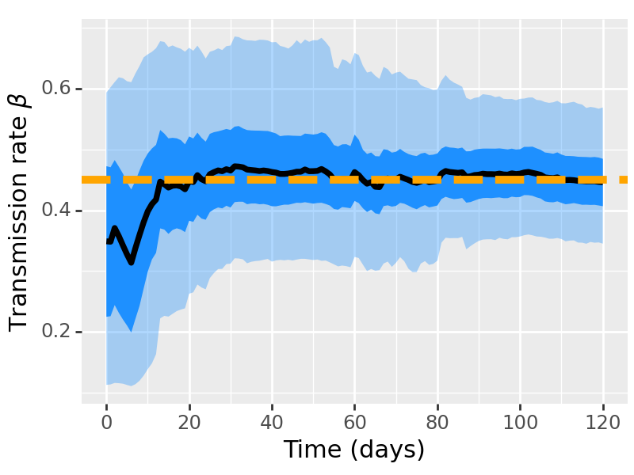

# Stochastic-SEIR-model-with-SMC
Implementation of a stochastic SEIR model using a kernel density-based particle filter for  oline state and parameter estimation. This repository includes detailed simulations using synthetics and real data.

## About
This repository contains the implementation of a stochastic model to simulate and forecast the spread of COVID-19 in Ireland. The model is based on compartmental epidemiological structures and uses a sequeltial monte carlo to estimate and update state trajectories and model parameters over time. Link to the paper on arXiv [Link to the paper on arXiv](https://arxiv.org/abs/2408.15739)


## Table of Contents
- [Introduction](#introduction)
- [Model Description](#model-description)
- [Installation](#installation)
- [Model Inputs](#model-inputs)
- [Model Outputs](#model-outputs)
- [Example Usage](#example-usage)
- [User Modifications](#user-modifications)

## Introduction
The COVID-19 Stochastic Model aims to provide a detailed simulation of the virus's spread within the population of Ireland. By incorporating real data and using a particle filter, the model can produce accurate state estimates and time-varying reproduction number

## Model Description
For a simple SEIR model, the modelled states are: susceptibles (S), exposed (E), infected (I) and removed (R).

$$
\begin{aligned}
S_{t+ \delta t} &= S_{t} - Y_{SE}(t), & Y_{SE}(t) &\sim \mathrm{Bin}\left(S_{t}, 1-e^{-\beta \frac{ I_{t}}{N} \delta t}\right) \\
E_{t+ \delta t} &= E_{t} + Y_{SE}(t) - Y_{EI}(t), & Y_{EI}(t) &\sim \mathrm{Bin}\left(E_{t}, 1-e^{-\sigma \delta t}\right) \\
I_{t+ \delta t} &= I_{t} + Y_{EI}(t) -  Y_{IR}(t), & Y_{IR}(t) &\sim \mathrm{Bin}\left(I_{t}, 1-e^{-\gamma \delta t}\right) \\
R_{t+ \delta t} &= R_{t} + Y_{IR}(t). &
\end{aligned}
$$

When there is not many vraiation in the data, the observation of daily new infections is modeled using the Poisson distribution, which offers an intuitive interpretation for generating daily count events on a given day, denoted as $y_{t}|x_{t}\sim\mathrm{Poisson}(Y_{EI}(t))$.

## Installation
To install and set up the environment for running this model, follow these steps:

1. Clone the repository:
    ```bash
    git clone https://github.com/Dhorasso/ksf_seir.git
    ```
2. Install the required dependencies:
    ```bash
    pip install -r requirements.txt
    ```


##  Model Inputs

The  `Kernel_Smoothing_Filter` function thake as inputs:

- `model`: Model function (e.g., SIR, SEIR, extended-SEIR stochastic model)
- `initial_state_info`: Information about the initial state of the system  (dictionary)
- `initial_theta_info`: Initial parameters information  (dictionary)
- `observed_data`: Observed data (a DataFrame)
- `num_particles`: Number of particles 
- `resampling_threshold`: Threshold for effective sample size in resampling  
- `delta`: Parameter for updating theta during resampling  (default is 0.99) 
- `population_size`: Total population size  
- `resampling_method`: Method for particle resampling ('stratified' by default)  
- `observation_distribution`: Distribution of observations ('poisson by default) 
- `forecast_days`: Number of days to forecast  (default is 0)
- `dt`: Time step (default is 1)
- `num_cores`: Number of processor to be used in parallel ( defaut all available -1) 
- `show_progress`: Whether to display a progress bar during computation  (default is TRue)

#### Initial State Information (`initial_state_info`)

The `initial_state_info` dictionary should contain the initial state variables of the model. Each state variable should be defined with the following information:
- `state name `and  `prior distribution`: A list specifying `[lower_bound, upper_bound, mean, std_deviation, distribution_type]`.

#### Initial Parameters Information (`initial_theta_info`)

 The initial_theta_info dictionary should contain the initial parameters of the model. Each parameter should be defined with the following information:

- `parameter name` and `prior distribution`: A list specifying `[lower_bound/shape, upper_bound/scale, mean, std_deviation, distribution_type]`.The distribution can be 'uniform', 'normal', 'trunorm', 'lognormal', 'gamma', or 'invgamma'. The lower and upper values only work for 'uniform' and 'trunorm'.

##  Model Outputs 
- `margLogLike`: Marginal log-likelihood of the observed data given the model.
- `trajState`: Trajectories of the state variables over time.
- `trajtheta`: Trajectories of the model parameters over time.

## Example Usage

#####  Import necessary modules
```python
import numpy as np
import pandas as pd
import matplotlib.pyplot as plt
from plotnine import*
from joblib import Parallel, delayed  # For parallel computing
from tqdm import tqdm                 # For Display the progress
from simulated_data import*           # For Generate synthetic data
from stochastic_epidemic_model import seir_model_const, seir_model_var, stochastic_model_covid
from particle_filter import Kernel_Smoothing_Filter
from trace_plot import trace_smc, trace_smc_covid, plot_smc, plot_smc_covid

```

##### Define  your model
```python
# Define your SEIR Or extended-SEIR model
# See stochastic_epidemic_model.py file to see you shoud define your mode
# Here is a simple example with constant transmission rate
# It is reasonable to assume that the epidemiological parameters remain constant during the early stage period.
# For disease with multiples wave is recommend to use a time-varying transmission rate
# ( see seir_model_var for more detail)

def seir_model_const(y, theta, theta_names, dt=1):
    """
    Discrete-time stochastic SEIR model.

    Parameters:
    - y: Vector of variables [S, E, I, R, NI]
            S: susceptible
            E: Exposed
            I: Infected
            R: Recovered
            NI: New infected (used to link with observations)
    - theta: Set of parameters
    - theta_names: Name of the parameters:
            beta: Transmission rate
            sigma: Latency rate
            gamma: Recovery rate

    Returns:
    - y_next: Updated vector of variables [S, E, I, R]
    """

    # Unpack variables
    S, E, I, R, NI= y
    N = S + E + I + R

    # Unpack parameters
    param= dict(zip(theta_names,theta))

    # Binomial distributions for transitions
    P_SE = 1 - np.exp(-param['beta'] * I / N * dt)  # Probability of transition from S to E
    P_EI = 1 - np.exp(-param['sigma'] * dt)      # Probability of transition from E to I
    P_IR = 1 - np.exp(-param['gamma'] * dt)      # Probability of transition from I to R


    # Binomial distributions for transitions
    B_SE = np.random.binomial(S, P_SE)
    B_EI = np.random.binomial(E, P_EI)
    B_IR = np.random.binomial(I, P_IR)

    # Update the compartments
    S += -B_SE
    E += B_SE - B_EI
    I += B_EI - B_IR
    R += B_IR
    NI= B_EI

    y_next = [max(0, compartment) for compartment in [S, E, I, R,  NI]] # Ensure non-negative elements

    return y_next
```

##### Generate simulated data or use your actual data

```python
# Important note: column of observed data must be named 'obs'. If the user wants to change it,
# they must also update the function compute_log_weight in the weight_processing.py file.

# Example data
# data = pd.read_csv('covid19_ireland_data.csv')  # Replace with your actual data file

# or generate synthetic data
true_theta = [0.45, 1/3, 1/5]
N_pop=6000
InitialState_example = [N_pop-1, 0, 1, 0, 0] #  ['S', 'E', 'I', 'R', 'NI']

t_start = 0
t_end = 120
dt_example = 1 #time step 

# Specify the seed for reproductibility
np.random.seed(123)
results_example = solve_seir_const_beta(seir_const_beta, true_theta, InitialState_example, t_start, t_end, dt_example)
simulated_data = pd.DataFrame({'time': results_example['time'], 'obs': results_example['NI']})
```

##### Define  your prior setting and run 

```python

# Define initial state information
# The user can change the state names except for 'NI'. If the user wants to change it,
# they must also update the function compute_log_weight in the weight_processing.py file.
state_info = {
    'S': {'prior': [N_pop - 5, N_pop, 0, 0, 'uniform']},  
    'E': {'prior': [0, 0, 0, 0, 'uniform']},
    'I': {'prior': [0, 5, 0, 0, 'uniform']},
    'R': {'prior': [0, 0, 0, 0, 'uniform']},
    'NI': {'prior': [0, 0, 0, 0, 'uniform']}
}

# Define initial theta information
# only put parameter with unkown value. If the value of a parameter is know it will
# be better to include it direcly in the model to reduce uncertainty
# For this example we will infer all the three parameters
theta_info = {
    'beta': {'prior': [0.1, 0.6,0,0, 'uniform']},
    'sigma': {'prior': [1/14, 1/2,0,0, 'uniform']},
    'gamma': {'prior': [1/15, 1/2,0,0, 'uniform']},
}

# Run Particle Filter
results_filter =  Kernel_Smoothing_Filter(
    model=seir_model_const, 
    initial_state_info=state_info , 
    initial_theta_info=theta_info , 
    observed_data=simulated_data,
    population_size=N_pop,
    num_particles=10000,
    resampling_method='stratified',
    observation_distribution='poisson', 
    show_progress=True
)

print("Marginal log_likelihood=", results_filter['margLogLike'])

#####################
# SAVE YOUR RESULTS #
#####################
# # open a new cell and copy this
# import pickle

# # Assuming results_filter is your resultsd 
# with open("results_filte.pickle", "wb") as file:
#     pickle.dump(results_filte, file)

# If you want to open it letter
# with open("results_filter.pickle", "rb") as file:
#    results_filter= pickle.load(file)
```

##### Plot your results

```python
# Plot of the states

trajParticles = results_filter['trajState']
matrix_dict = trace_smc(trajParticles)


# Iterate through each key-value pair in matrix_dict and plot in a subplot
for (state, matrix) in matrix_dict.items():
    p = plot_smc(matrix) # use plot_smc(matrix, color='dodgerblue', CI_50=False, CI_95=False) if you don't want 
                         # the 50% or 95% CI to appear  or to change the color
    if state == 'NI': # To plot the data with the filered estimate
        p +=geom_point(aes(x=simulated_data['time'], y=simulated_data['obs']),  fill='salmon', color='darkorange', size=1.5)
    p += theme(figure_size=(5,4))
    if state == 'NI':
        p += ylab("Daily new cases") 
    else:
        p += ylab(state) 
    p += xlab("Time (days)")
    fig = p.draw()
    print(p) 
```


```python
# Plot of the parameters
trajParticles = results_filter['trajtheta']
matrix_dict = trace_smc(trajParticles)

Param_label = [r'Transmission rate $\beta$', r' Latency rate $\sigma$', r'Recovery rate $\gamma$']

# Iterate through each key-value pair in matrix_dict and plot in a subplot
for i, (state, matrix) in enumerate(matrix_dict.items()):

    p = plot_smc(matrix) # use plot_smc(matrix, color='dodgerblue', CI_50=False, CI_95=False) if you don't want 
                         # the 50% or 95% CI to appear  or to change the color
    p = p + geom_hline(yintercept=true_theta[i], color='orange', linetype='dashed', size=2)
    p += theme(figure_size=(4,3))
    p+= ylab(Param_label[i])
    p += xlab("Time (days)")

    print(p)

```
<p>
  
  
  
</p>

Example with time-varying transmission rate and application to Ireland COVID-19 data can be found in the Test folder

## User Modifications
Users can modify the SEIR model as described above, but they can also modify the likelihood function. This involves changing the `compute_log_weight` function in the `weight_processing.py` file.

```python

# Simple example on how to modify it for Poisson and Negative Binomial observation distributions
# If a parameter appears in the compute_log_weight, it must be introduced in the theta_info set
# or given a fixed value by the user.

def compute_log_weight(observed_data_point, model_data_point, theta, theta_names, distribution_type):
    """

    Compute the log_likelihood of observing a single data point given the model's prediction.
    ***IMPORTANT*** user may need to change the column name of observed new case to 'obs'
    the computation of the weights can be modify depending on all the data sources aviable 
    Parameters:
    - observed_data_point: Observed number of infected individuals
    - model_data_point: Predicted number of infected individuals from the model
    - theta_params: Parameters of the model
    - theta_names: Names of the theta parameters
    - distribution_type: Type of distribution ('poisson' by default, also supports 'normal', 
                         'normal_approx_negative_binomial', or 'negative_binomial')

    Returns:
    - log_likelihood: log_likelihood of the observation
    """

    param = dict(zip(theta_names, np.exp(theta)))
    y = observed_data_point['obs']
    model_est_case = model_data_point['NI']

    if distribution_type == 'poisson':
        log_likelihood = poisson.logpmf(y, mu=model_est_case)

    elif distribution_type == 'negative_binomial':
        # The overdispersion parameter can be inferred using the Kernel_Smoothing_Filter by adding it
        # to the theta_info parameter or can be set manually
        overdispersion = param['phi']
        p = 1 / (1 + overdispersion * model_est_case)
        n = 1 / overdispersion
        log_likelihood = nbinom.logpmf(y, n, p)

    else:
        raise ValueError("Invalid distribution type")

    if np.isfinite(log_likelihood):
        return log_likelihood
    else:
        return -np.inf


```
